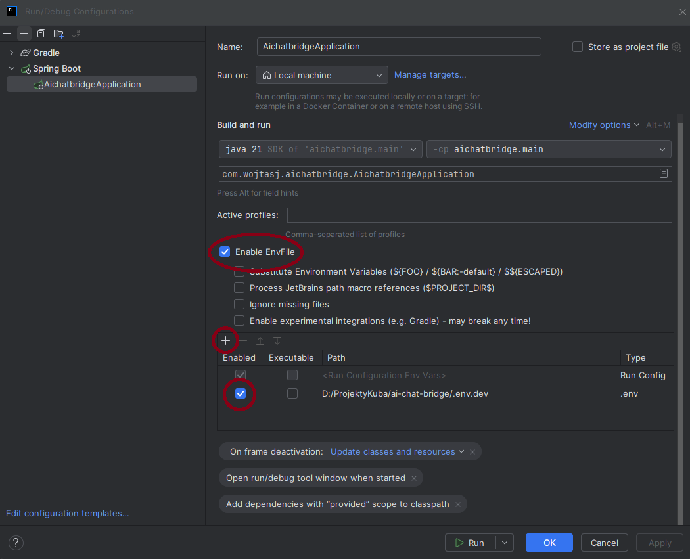

# AI Chat Bridge
**AI Chat Bridge** is a Spring-based application that enables seamless AI conversations using OpenAI's models through a web interface with robust user management and a Discord bot, designed for easy extensibility to support additional AI models and platforms.

## Features
- **OpenAI Integration**: OpenAIService and controller enabling seamless interaction with OpenAI models for sending and receiving AI responses.
- **Discord Bot**: DiscordBotService for real-time AI responses on Discord server chats, communicating with OpenAI without user authentication.
- **Extensible Architecture**: Clean, modular code design allowing easy integration of additional AI models (e.g., Claude, Llama) and bot platforms (e.g., Slack, Telegram).
- **JWT Authentication**: Stateless JWT-based authentication with refresh tokens, supporting user registration, login, management of credentials (e.g., passwords, API keys, model preferences).
- **Role-Based Security**: SecurityConfig for managing endpoint access based on user roles (e.g., user, admin).
- **Robust Logging**: Comprehensive logging system with file output and source-specific categorization for application and dependency events.
- **Global Exception Handling**: Custom exceptions (e.g., UserAlreadyExistsException, OpenAIServiceException) and GlobalExceptionHandler for robust error management.
- **Database Migrations**: Flyway for automated database schema migrations, ensuring consistent database setup across environments.
- **Environment Management**: Support for development and production environments with .env files and separate application.yaml configurations.
- **Containerized Deployment**: Dockerfiles for backend and frontend, with docker-compose configurations for development and production environments, including PostgreSQL.
- **CI/CD Pipeline**: Automated build, test, and image push to GitHub Container Registry via GitHub Actions, utilizing GitHub Secrets for secure production environment configuration.
- **Comprehensive Testing**: Unit and integration tests using JUnit with MockMvc and H2 database to ensure reliability and maintainability.

## Technologies
- **Backend**: Spring Boot 3.5.5, Java 21, Spring Security, Spring Data JPA, Flyway 11.11.2 for database migrations
- **Frontend**: React, Vite for fast build and development
- **Database**: PostgreSQL for production, H2 for testing
- **APIs**: OpenAI API, Discord4J 3.3.0-RC3 for Discord bot integration
- **Authentication**: JJWT 0.13.0 for stateless JWT-based authentication
- **Resilience**: Resilience4J 2.3.0 for fault tolerance and rate limiting
- **DevOps**: Docker, Docker Compose for containerized deployment, GitHub Actions for CI/CD
- **Tools**: Git, IntelliJ IDEA, WebStorm, Postman, Swagger (OpenAPI 2.8.12) for API documentation
- **Testing**: JUnit 5.13.4, Testcontainers 1.21.3, Mockito 5.19.0, WireMock 3.0.1
- **Utilities**: Lombok for boilerplate reduction, JSON 20250517 for JSON handling

## Prerequisites
- Java 21 (JDK)
- Node.js 22.12.0
- Docker Desktop
- OpenAI API key from [OpenAI Developer Platform](https://platform.openai.com/)
- Discord Bot Token from [Discord for Developers](https://discord.com/developers/)
- Git for cloning the repository
- (Optional) IntelliJ IDEA or WebStorm for development
- (Optional) Postman for API testing

## Installation
1. Clone the repository:
   ```bash
   git clone git@github.com:wojtas-j/ai-chat-bridge.git
   cd ai-chat-bridge
   ```
2. Configure environment variables by copying `.env.dev.example` to `.env.dev` and filling in required values (e.g., OpenAI API key, Discord Bot Token).
3. Build and run the application using Docker Compose:
   ```bash
   docker compose -f docker-compose-dev.yaml up --build
   ```
4. Access the web interface at `http://localhost:3000` and add the Discord bot to a server using the token from the Discord Developer Portal.

## Usage

### Running the Application
- **Using Docker Compose**:
    1. Ensure Docker Desktop is running.
    2. Build and run the application:
       ```bash
       docker compose -f docker-compose-dev.yaml up --build
       ```
- **Using IntelliJ IDEA**:
    1. Configure environment variables in IntelliJ (e.g., `POSTGRES_DB`, `OPENAI_API_KEY_FOR_DISCORD`, `DISCORD_BOT_TOKEN`).  
       
    2. Run the `AichatbridgeApplication` class.
- **Using PowerShell Script**:
    1. Edit `start-prod.ps1` to fill in environment variables (e.g., `POSTGRES_DB`, `OPENAI_API_KEY_FOR_DISCORD`).
    2. Run the script:
       ```powershell
       ./start-prod.ps1
       ```

### Web Interface
- Access the application at `http://localhost:3000` after starting the services.
- Register and log in with your credentials to access the AI chat.
- Send messages to OpenAI's GPT-4o model and view your conversation history.

### Discord Bot
- Generate a Discord Bot Token from the [Discord Developer Portal](https://discord.com/developers/).
- Add the token to your `.env.dev` or `start-prod.ps1` configuration.
- Invite the bot to your Discord server using the token.
- Send messages in any server chat where the bot is present to receive real-time responses powered by OpenAI's GPT-4o.

### API Testing
- **Swagger UI**: Access the API documentation at `http://localhost:8080/swagger-ui/index.html` to test endpoints interactively.
- **Postman**: Use `http://localhost:8080` as the base URL to test API endpoints.
- **Key Endpoints**:
    - **Register a User**:
      ```http
      POST /api/auth/register
      Content-Type: application/json
      {
        "username": "exampleUser",
        "email": "user@example.com",
        "password": "securePassword123",
        "apiKey": "your-openai-api-key",
        "maxTokens": 500,
        "model": "gpt-4o-mini"
      }
      ```
    - **Login**:
      ```http
      POST /api/auth/login
      Content-Type: application/json
      {
        "username": "exampleUser",
        "password": "securePassword123"
      }
      ```
      Returns a JWT token and refresh token for authenticated requests.
    - **Send Message to OpenAI** (requires JWT authentication):
      ```http
      POST /api/openai
      Content-Type: application/json
      Authorization: Bearer <your-jwt-token>
      {
        "content": "Hello, how can you assist me today?"
      }
      ```

### Database Access
- The PostgreSQL database runs on `localhost:5432` when using Docker Compose.
- Use the credentials specified in `.env.dev` (e.g., `POSTGRES_USER`, `POSTGRES_PASSWORD`) to connect.

## Project Structure

```
aichatbridge/                                   # Project root directory
├── .gitignore                                  # Git ignore file
├── .gitattributes                              # Git attributes configuration
├── LICENSE                                     # MIT License file
├── README.md                                   # Project documentation
├── docker-compose-dev.yaml                     # Docker Compose configuration for development
├── docker-compose-prod.yaml                    # Docker Compose configuration for production
├── .env.dev                                    # Environment variables for development
├── .env.dev.example                            # Example environment variables file
├── docs/                                       # Documentation resources
│   ├── images/                                 # Images for documentation
│   │   ├── env-config.png                      # Screenshot for environment variables setup
├── .github/                                    # GitHub configuration
│   ├── workflows/                              # CI/CD workflows
│   │   ├── ci.yaml                             # GitHub Actions CI/CD pipeline
├── backend/                                    # Backend source code (Spring Boot)
│   ├── logs/                                   # Log files generated by the application
│   ├── gradle/                                 # Gradle build cache
│   ├── Dockerfile                              # Docker configuration for backend
│   ├── build.gradle                            # Gradle build configuration
│   ├── gradlew                                 # Gradle wrapper for Unix
│   ├── gradlew.bat                             # Gradle wrapper for Windows
│   ├── settings.gradle                         # Gradle project settings
│   ├── src/main/java/com/wojtasj/aichatbridge/ # Main Java source code
│   │   ├── configuration/                      # Configuration classes
│   │   │   ├── SecurityConfig.java             # Spring Security configuration
│   │   │   ├── DiscordProperties.java          # Discord-related configuration properties
│   │   │   ├── JwtAuthenticationFilter.java    # JWT authentication filter
│   │   │   ├── JwtProperties.java              # JWT configuration properties
│   │   │   ├── OpenAIProperties.java           # OpenAI API configuration properties
│   │   │   ├── AuthenticationManager.java      # Authentication manager configuration
│   │   │   ├── SwaggerConfig.java              # Swagger API documentation configuration
│   │   │   ├── EncryptionProperties.java       # Encryption configuration properties
│   │   ├── controller/                         # REST API controllers
│   │   │   ├── MessageController.java          # Handles message-related endpoints
│   │   │   ├── AuthenticationController.java   # Handles user authentication endpoints
│   │   │   ├── OpenAIController.java           # Handles OpenAI API interactions
│   │   │   ├── DiscordMessageController.java   # Handles Discord message endpoints
│   │   │   ├── AdminController.java            # Handles admin-specific endpoints
│   │   │   ├── UserController.java             # Handles user management endpoints
│   │   ├── dto/                                # Data Transfer Objects
│   │   │   ├── LoginRequest.java               # DTO for login requests
│   │   │   ├── LoginResponse.java              # DTO for login responses
│   │   │   ├── MessageDTO.java                 # DTO for message data
│   │   │   ├── RefreshTokenRequest.java        # DTO for refresh token requests
│   │   │   ├── RegisterRequest.java            # DTO for user registration
│   │   │   ├── TokenResponse.java              # DTO for token responses
│   │   │   ├── UserDTO.java                    # DTO for user data
│   │   │   ├── UpdateEmailRequest.java         # DTO for updating user email
│   │   │   ├── UpdateMaxTokensRequest.java     # DTO for updating OpenAI max tokens
│   │   │   ├── UpdateModelRequest.java         # DTO for updating OpenAI model
│   │   │   ├── UpdateOpenAIApiKeyRequest.java  # DTO for updating OpenAI API key
│   │   │   ├── UpdatePasswordRequest.java      # DTO for updating user password
│   │   │   ├── AdminGetUserResponse.java       # DTO for admin user data retrieval
│   │   ├── entity/                             # JPA entities
│   │   │   ├── MessageEntity.java              # Entity for messages
│   │   │   ├── RefreshTokenEntity.java         # Entity for refresh tokens
│   │   │   ├── Role.java                       # Entity for user roles
│   │   │   ├── UserEntity.java                 # Entity for users
│   │   │   ├── BaseMessage.java                # Base entity for messages.
│   │   ├── exception/                          # Custom exceptions
│   │   │   ├── AccessDeniedException.java      # Exception for access denial
│   │   │   ├── AuthenticationException.java    # Base authentication exception
│   │   │   ├── DiscordServiceException.java    # Exception for Discord service errors
│   │   │   ├── MessageNotFoundException.java   # Exception for missing messages
│   │   │   ├── GlobalExceptionHandler.java     # Global exception handler
│   │   │   ├── OpenAIServiceException.java     # Exception for OpenAI service errors
│   │   │   ├── UserAlreadyExistsException.java # Exception for duplicate users
│   │   ├── repository/                         # JPA repositories
│   │   │   ├── MessageRepository.java          # Repository for messages
│   │   │   ├── RefreshTokenRepository.java     # Repository for refresh tokens
│   │   │   ├── UserRepository.java             # Repository for users
│   │   ├── service/                            # Service classes
│   │   │   ├── AuthenticationService.java      # Authentication service interface
│   │   │   ├── AuthenticationServiceImpl.java  # Authentication service implementation
│   │   │   ├── DiscordBotService.java          # Discord bot service interface
│   │   │   ├── DiscordBotServiceImpl.java      # Discord bot service implementation
│   │   │   ├── JwtTokenProvider.java           # JWT token provider interface
│   │   │   ├── JwtTokenProviderImpl.java       # JWT token provider implementation
│   │   │   ├── OpenAIService.java              # OpenAI service interface
│   │   │   ├── OpenAIServiceImpl.java          # OpenAI service implementation
│   │   │   ├── RefreshTokenService.java        # Refresh token service interface
│   │   │   ├── RefreshTokenServiceImpl.java    # Refresh token service implementation
│   │   │   ├── MessageService.java             # Message service interface
│   │   │   ├── MessageServiceImpl.java         # Message service implementation
│   │   │   ├── DiscordMessageService.java      # Discord message service interface
│   │   │   ├── DiscordMessageServiceImpl.java  # Discord message service implementation
│   │   │   ├── UserService.java                # User service interface
│   │   │   ├── UserServiceImpl.java            # User service implementation
│   │   │   ├── AdminService.java               # Admin service interface
│   │   │   ├── AdminServiceImpl.java           # Admin service implementation
│   │   ├── utils/                              # Utility classes
│   │   │   ├── ApiKeyConverter.java            # Utility for API key conversion
│   │   ├── AichatbridgeApplication.java        # Main Spring Boot application
│   ├── src/main/resources/                     # Resource files
│   │   ├── application.yaml                    # Default application configuration
│   │   ├── application-dev.yaml                # Development environment configuration
│   │   ├── application-prod.yaml               # Production environment configuration
│   │   ├── db/migration/                       # Flyway database migrations
│   │   │   ├── V1__create_message_table.sql                     # Creates message table
│   │   │   ├── V2__create_users_and_roles_tables.sql            # Creates users and roles tables
│   │   │   ├── V3__create_refresh_tokens_table.sql              # Creates refresh tokens table
│   │   │   ├── V4__create_discord_message_table.sql             # Creates Discord message table
│   │   │   ├── V5__add_api_key_and_max_tokens_to_user_table.sql # Adds API key and max tokens to user table
│   │   │   ├── V6__add_user_id_to_messages.sql                  # Adds user ID to messages
│   │   │   ├── V7__add_model_to_user.sql                        # Adds model selection to user table
│   ├── src/test/java/com/wojtasj/aichatbridge/   # Test source code
│   │   ├── configuration/                        # Configuration tests
│   │   │   ├── JwtAuthenticationFilterTest.java  # Tests for JWT authentication filter
│   │   │   ├── SecurityConfigTest.java           # Tests for Spring Security configuration
│   │   │   ├── TestBeansConfig.java              # Test-specific bean configuration
│   │   ├── controller/                           # Controller tests
│   │   │   ├── MessageControllerTest.java        # Tests for MessageController
│   │   │   ├── AuthenticationControllerTest.java # Tests for AuthenticationController
│   │   │   ├── OpenAIControllerTest.java         # Tests for OpenAIController
│   │   │   ├── DiscordMessageControllerTest.java # Tests for DiscordMessageController
│   │   │   ├── UserControllerTest.java           # Tests for UserController
│   │   │   ├── AdminControllerTest.java          # Tests for AdminController
│   │   ├── exception/                            # Exception tests
│   │   │   ├── GlobalExceptionHandlerTest.java   # Tests for global exception handler
│   │   ├── repository/                           # Repository tests
│   │   │   ├── MessageRepositoryTest.java        # Tests for MessageRepository
│   │   │   ├── RefreshTokenRepositoryTest.java   # Tests for RefreshTokenRepository
│   │   │   ├── UserRepositoryTest.java           # Tests for UserRepository
│   │   ├── service/                              # Service tests
│   │   │   ├── AuthenticationServiceTest.java    # Tests for AuthenticationServiceImpl
│   │   │   ├── DiscordBotServiceTest.java        # Tests for DiscordBotServiceImpl
│   │   │   ├── JwtTokenProviderTest.java         # Tests for JwtTokenProviderImpl
│   │   │   ├── OpenAIServiceTest.java            # Tests for OpenAIServiceImpl
│   │   │   ├── RefreshTokenServiceTest.java      # Tests for RefreshTokenServiceImpl
│   │   │   ├── MessageServiceTest.java           # Tests for MessageServiceImpl
│   │   │   ├── DiscordMessageServiceTest.java    # Tests for DiscordMessageServiceImpl
│   │   │   ├── UserServiceTest.java              # Tests for UserServiceImpl
│   │   │   ├── AdminServiceTest.java             # Tests for AdminServiceImpl
│   │   ├── utils/                                # Utility tests
│   │   │   ├── ApiKeyConverterTest.java          # Tests for ApiKeyConverter
│   ├── src/test/resources/                       # Test resources
│   │   ├── application-test.yaml                 # Test environment configuration
├── frontend/                                     # Frontend source code (React)
│   ├── Dockerfile                                # Docker configuration for frontend
│   ├── src/                                      # React source code
│   │   ├── App.css                               # Styles for main application
│   │   ├── App.tsx                               # Main React component
│   │   ├── index.css                             # Global CSS styles
│   │   ├── main.tsx                              # Entry point for React application
│   │   ├── vite-env.d.tsx                        # TypeScript environment definitions
│   ├── .eslint.config.js                         # ESLint configuration for linting
│   ├── index.html                                # HTML entry point for React
│   ├── package.json                              # Node.js dependencies and scripts
│   ├── package-lock.json                         # Lock file for Node.js dependencies
│   ├── tsconfig.app.json                         # TypeScript configuration for app
│   ├── tsconfig.json                             # General TypeScript configuration
│   ├── tsconfig.node.json                        # TypeScript configuration for Node
│   ├── vite.config.ts                            # Vite configuration for frontend
```


## Testing
The project includes comprehensive unit and integration tests to ensure reliability and maintainability:
- **Unit Tests**: Test core components (e.g., services, controllers) using JUnit 5.13.4 and Mockito 5.19.0.
- **Integration Tests**: Test API endpoints and database interactions with Testcontainers 1.21.3, MockMvc, and H2 database.
- **Mocking**: Use WireMock 3.0.1 for mocking external API calls (e.g., OpenAI).
- **CI/CD**: GitHub Actions runs all tests automatically on push to `master` or pull requests, ensuring code quality.
  To run tests locally:
    ```bash
    cd backend
  ./gradlew test
    ```

## Roadmap
- Enhance GitHub Container Registry integration in the CI/CD pipeline for reliable image publishing.
- Develop a comprehensive frontend for complete user management and interaction with AI features.
- Integrate Facebook API to enable bot functionality similar to the Discord bot.
- Add support for additional AI models beyond OpenAI, such as Claude or Llama, for enhanced flexibility.

## Contributing
Contributions are welcome! You can extend the pipeline by adding new services, exceptions or apis, following the guidelines below.

### Extending the Project

The *AI Chat Bridge* is designed for easy extensibility. Below are guidelines for adding new message entities, custom exceptions, AI models, or bot platforms.

### Adding a New Message Entity
To support messages from new platforms (e.g., Slack, Telegram), create a new entity extending `BaseMessage`. For example, to add a `SlackMessageEntity`:

```java
package com.wojtasj.aichatbridge.entity;

import jakarta.persistence.*;
import lombok.Getter;
import lombok.Setter;
import lombok.experimental.SuperBuilder;
import lombok.extern.slf4j.Slf4j;

@Entity
@Table(name = "slack_messages")
@Getter
@Setter
@SuperBuilder
@Slf4j
public class SlackMessageEntity extends BaseMessage {
    @Column(name = "slack_channel_id")
    private String slackChannelId;

    // Add additional fields or methods specific to Slack messages
}
```

1. Create a new table in the database using Flyway (e.g., `V8__create_slack_message_table.sql` in `backend/src/main/resources/db/migration/`).
2. Implement a service (e.g., `SlackMessageService`) and controller (e.g., `SlackMessageController`) similar to `DiscordMessageService` and `DiscordMessageController`.

### Adding a Custom Exception
To handle errors for new services (e.g., Slack bot), create a custom exception and integrate it with `GlobalExceptionHandler`. For example, to add a `SlackServiceException`:

```java
package com.wojtasj.aichatbridge.exception;

public class SlackServiceException extends RuntimeException {
    public SlackServiceException(String message) {
        super(message);
    }
    public SlackServiceException(String message, Throwable cause) {
        super(message, cause);
    }
}
```

Add handling in `GlobalExceptionHandler`:

```java
@ExceptionHandler(SlackServiceException.class)
public ResponseEntity<Map<String, Object>> handleSlackServiceException(SlackServiceException ex, HttpServletRequest request) {
    log.error("Slack error: {}", ex.getMessage(), ex);
    return buildProblemDetailsResponse(
            HttpStatus.INTERNAL_SERVER_ERROR,
            "Slack Service Error",
            ex.getMessage(),
            "/problems/slack-service-error",
            request.getRequestURI()
    );
}
```

To test the exception, add a unit test in `backend/src/test/java/com/wojtasj/aichatbridge/exception/GlobalExceptionHandlerTest.java`:

```java
@Test
void shouldHandleSlackServiceException() throws Exception {
    mockMvc.perform(post("/test/slack")
            .contentType(MediaType.APPLICATION_JSON))
            .andExpect(status().isInternalServerError())
            .andExpect(jsonPath("$.type").value("/problems/slack-service-error"))
            .andExpect(jsonPath("$.title").value("Slack Service Error"))
            .andExpect(jsonPath("$.status").value(500))
            .andExpect(jsonPath("$.detail").value("Failed to process Slack request"))
            .andExpect(jsonPath("$.instance").value("/test/slack"));
}
```

Update the `TestController` in the same file to simulate the exception:

```java
@PostMapping("/test/slack")
public void throwSlackServiceException() {
    throw new SlackServiceException("Failed to process Slack request");
}
```

### Adding New AI Models
To support additional AI models (e.g., Claude, Llama), create a new service and configuration properties. For example, to add Claude:

1. Create configuration properties in `backend/src/main/java/com/wojtasj/aichatbridge/configuration/`:

```java
package com.wojtasj.aichatbridge.configuration;

import lombok.Getter;
import lombok.Setter;
import org.springframework.boot.context.properties.ConfigurationProperties;
import org.springframework.stereotype.Component;

@Component
@ConfigurationProperties(prefix = "claude")
@Getter
@Setter
public class ClaudeProperties {
    private String baseUrl;
    private String chatEndpoint = "/messages";
    private String apiKey;
}
```

2. Add environment variables to `.env.dev`:

```yaml
CLAUDE_BASE_URL=https://api.anthropic.com/v1
CLAUDE_API_KEY=your-claude-api-key
```

3. Create a new service in `backend/src/main/java/com/wojtasj/aichatbridge/service/`:

```java
package com.wojtasj.aichatbridge.service;

import com.wojtasj.aichatbridge.entity.BaseMessage;
import com.wojtasj.aichatbridge.entity.UserEntity;
import com.wojtasj.aichatbridge.exception.ClaudeServiceException;
import lombok.RequiredArgsConstructor;
import org.springframework.stereotype.Service;

@Service
@RequiredArgsConstructor
public class ClaudeService {
    private final ClaudeProperties claudeProperties;

    public <T extends BaseMessage> T sendMessageToClaude(T message, boolean isBotMessage, UserEntity user) throws ClaudeServiceException {
        // Implement Claude API call logic here
        return message;
    }
}
```

4. Create a new `ClaudeController` to handle Claude-specific requests, similar to:

```java
@PostMapping("/claude")
@PreAuthorize("isAuthenticated()")
public ResponseEntity<MessageEntity> sendToClaude(@Valid @RequestBody ClaudeMessageDTO messageDTO, @AuthenticationPrincipal UserDetails userDetails) {
    UserEntity user = authenticationService.findByUsername(userDetails.getUsername());
    ClaudeMessageEntity message = MessageEntity.builder().content(messageDTO.content()).user(user).build();
    ClaudeEntity saved = messageRepository.save(message);
    ClaudeEntity response = claudeService.sendMessageToClaude(saved, false, user);
    return ResponseEntity.ok(messageRepository.save(response));
}
```

5. Add tests in `backend/src/test/java/com/wojtasj/aichatbridge/service/ClaudeServiceTest.java` to verify the new service.

### Adding New Bot Platforms
To integrate new bot platforms (e.g., Slack, Telegram), create a new service and configuration properties. For example, to add Slack:

1. Create configuration properties in `backend/src/main/java/com/wojtasj/aichatbridge/configuration/`:

```java
package com.wojtasj.aichatbridge.configuration;

import lombok.Getter;
import lombok.Setter;
import org.springframework.boot.context.properties.ConfigurationProperties;
import org.springframework.stereotype.Component;

@Component
@ConfigurationProperties(prefix = "slack")
@Getter
@Setter
public class SlackProperties {
    private String botToken;
    private String botPrefix;
    private boolean botEnabled;
    private String apiKey;
}
```

2. Add environment variables to `.env.dev`:

```bash
SLACK_BOT_TOKEN=your-slack-bot-token
SLACK_BOT_PREFIX=!slack
SLACK_API_KEY=your-openai-api-key
```

3. Create a new service in `backend/src/main/java/com/wojtasj/aichatbridge/service/`:

```java
package com.wojtasj.aichatbridge.service;

import com.wojtasj.aichatbridge.configuration.SlackProperties;
import com.wojtasj.aichatbridge.entity.SlackMessageEntity;
import com.wojtasj.aichatbridge.exception.SlackServiceException;
import lombok.RequiredArgsConstructor;
import org.springframework.stereotype.Service;

@Service
@RequiredArgsConstructor
public class SlackBotService {
    private final SlackProperties slackProperties;

    public void handleSlackMessage(String content, String channelId) throws SlackServiceException {
        SlackMessageEntity message = SlackMessageEntity.builder()
                .content(content)
                .slackChannelId(channelId)
                .build();
        // Implement Slack API call and OpenAI integration logic here
    }
}
```

4. Add endpoints in a new or existing controller (e.g., `SlackMessageController`) for Slack message handling.
5. Add tests in `backend/src/test/java/com/wojtasj/aichatbridge/service/SlackBotServiceTest.java` to verify the new service.

## License
This project is licensed under the MIT License. You are free to use, modify, and distribute this software, provided you include the original copyright notice and cite the author (Jakub Wojtaś) in any derivative works or publications. See `LICENSE` for details.

## Contact
- **Author**: Jakub Wojtaś
- **GitHub**: [wojtas-j](https://github.com/wojtas-j)
- **LinkedIn**: [Jakub Wojtaś](https://www.linkedin.com/in/jakub-wojta%C5%9B-58a287384/)

## Bibliography

The *AI Chat Bridge* project leverages the following technologies, libraries, and resources:

- **Spring Boot**: Framework for building the backend REST API and handling authentication, database interactions, and integrations.
    - [Official Documentation](https://spring.io/projects/spring-boot)
- **Spring Security**: Used for JWT-based authentication and authorization.
    - [Official Documentation](https://spring.io/projects/spring-security)
- **React**: Frontend framework for the web interface running on `http://localhost:3000`.
    - [Official Documentation](https://react.dev/)
- **Discord4J**: Library for integrating the Discord bot with the application.
    - [Official Documentation](https://github.com/Discord4J/Discord4J)
- **OpenAI API**: Provides AI-powered chat completions for web and Discord interactions.
    - [Official Documentation](https://platform.openai.com/docs)
- **PostgreSQL**: Database for storing messages, users, and refresh tokens.
    - [Official Documentation](https://www.postgresql.org/docs/)
- **Flyway**: Manages database migrations for schema versioning.
    - [Official Documentation](https://flywaydb.org/documentation/)
- **Resilience4j**: Handles rate limiting for API requests (e.g., refresh token endpoint).
    - [Official Documentation](https://resilience4j.readme.io/docs/)
- **Swagger**: Provides API documentation accessible at `http://localhost:8080/swagger-ui/index.html`.
    - [Official Documentation](https://swagger.io/docs/)
- **Docker**: Containerizes the backend and frontend for easy deployment.
    - [Official Documentation](https://docs.docker.com/)
- **GitHub Actions**: CI/CD pipeline for automated testing and deployment.
    - [Official Documentation](https://docs.github.com/en/actions)
- **Discord Developer Portal**: Used to generate bot tokens and configure the Discord bot.
    - [Official Portal](https://discord.com/developers/docs/intro)

